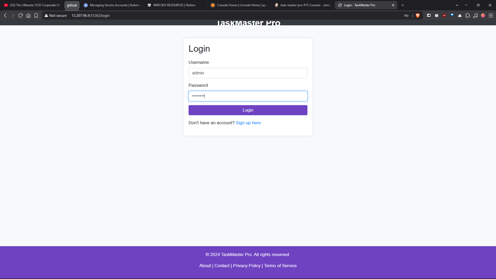
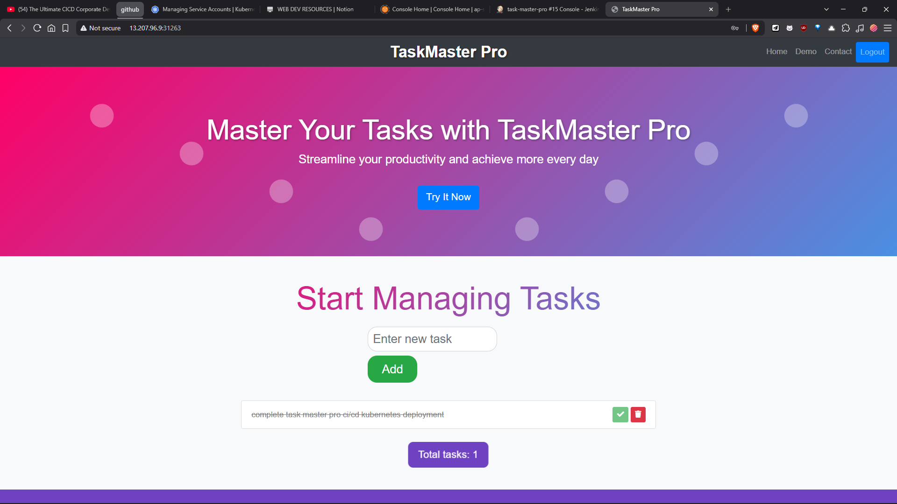
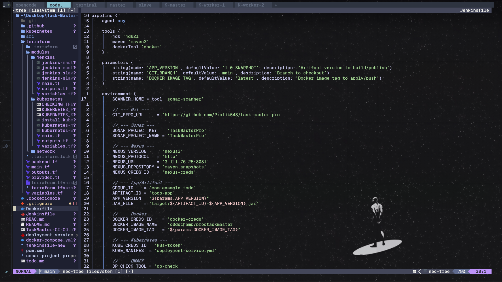
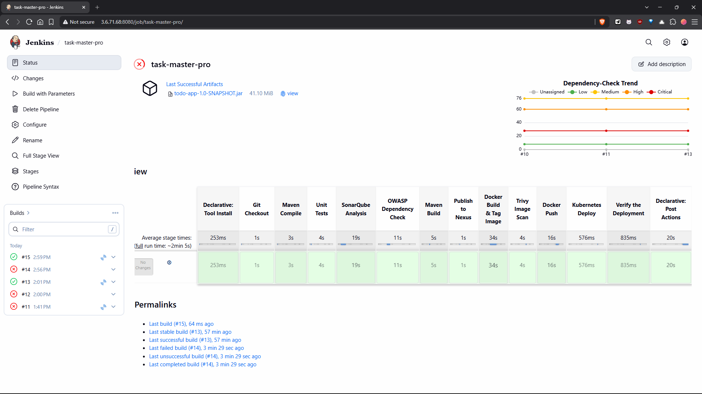
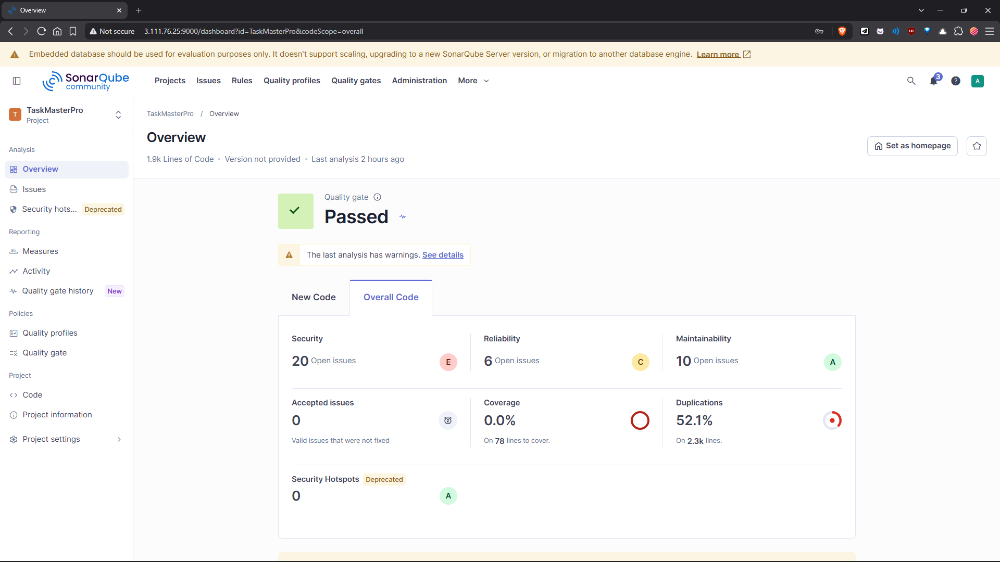
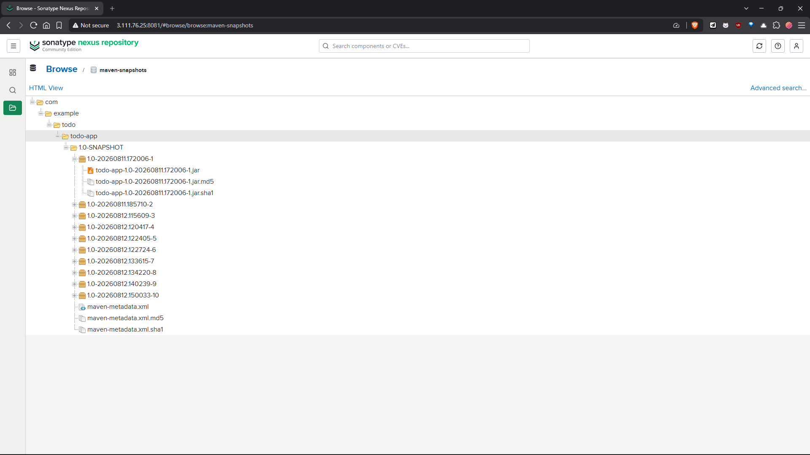
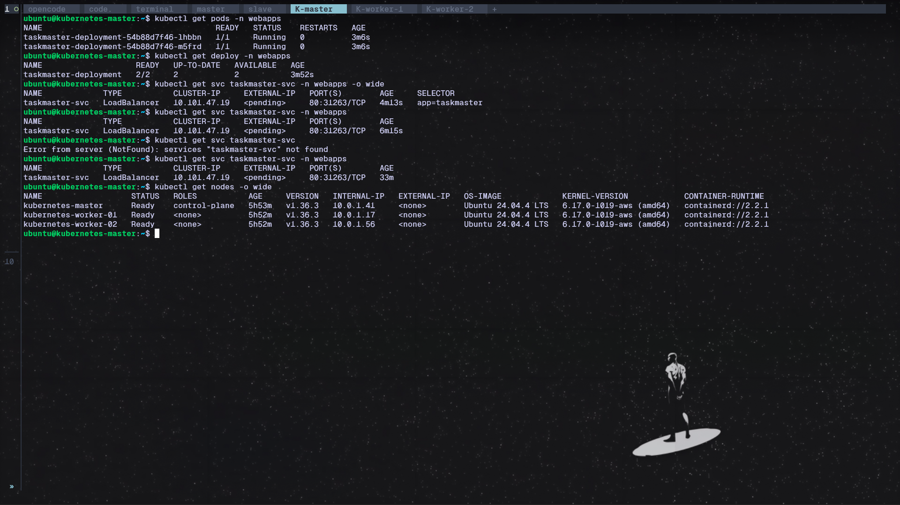

 Task Master Pro

Task Master Pro is a **Spring Boot** task management web application with user
authentication, backed by an in-memory H2 database. It ships with a full
**DevOps toolchain**: a multi-stage Dockerfile, GitHub Actions CD pipeline,
Jenkins/SonarQube/Nexus setup, Kubernetes manifests, RBAC for Jenkins, and an
**Infrastructure-as-Code (IaC) suite built with Terraform** for provisioning the
entire AWS environment (network, Jenkins, and Kubernetes nodes).


## Table of Contents

- [Introduction](#introduction)
- [Project Overview (Screenshots)](#project-overview-screenshots)
- [Technology Stack](#technology-stack)
- [Project Architecture](#project-architecture)
- [Features](#features)
- [Getting Started](#getting-started)
- [Docker](#docker)
- [CI / CD](#ci--cd)
- [Terraform IaC](#terraform-iac)
  - [Module Overview](#module-overview)
  - [Prerequisites](#prerequisites)
  - [Implementation Steps](#implementation-steps)
  - [Variables](#variables)
  - [Outputs](#outputs)
  - [Enabling Kubernetes](#enabling-kubernetes)
  - [Security Group Ports](#security-group-ports)
  - [Troubleshooting](#troubleshooting)
- [Project Structure](#project-structure)
- [Best Practices](#best-practices)
- [Testing](#testing)
- [Contributing](#contributing)
- [License](#license)
- [Contact](#contact)

---

## Introduction

Task Master Pro lets users **create, update, delete**, and track tasks through a
web interface. It demonstrates modern Java/Spring development practices plus a
production-style deployment pipeline:

```
Developer ──push──► GitHub ──► Jenkins ──► SonarQube (quality)
                                      └──► Nexus (artifact repo)
                                             └──► Docker Hub ──► Kubernetes ──► Users
```

All cloud infrastructure (VPC, subnets, security groups, Jenkins server +
slave, Kubernetes nodes) is created and managed with **Terraform** in the
[`terraform/`](./terraform) directory.

## Project Overview (Screenshots)

The web application — sign in and manage your tasks:

| | |
|---|---|
|  |  |

The CI/CD pipeline and its tools:

| | |
|---|---|
|  |  |
|  |  |
|  | |

## Technology Stack

**Application**
| Technology | Version | Purpose |
|------------|---------|---------|
| Java | 11 | Runtime language |
| Spring Boot | 2.5.4 | Web, Security, Data JPA, Thymeleaf |
| H2 | 1.4.200 | In-memory database |
| Thymeleaf | (via Boot) | Server-side templates |
| JUnit 5 | 5.7.0 | Testing |
| Maven | 3.8.x | Build tool |

**Containers & CI/CD**
- **Docker** — multi-stage build (`maven:3.8.3-openjdk-17` → `amazoncorretto:17.0.8-alpine3.18`)
- **GitHub Actions** — `deploy.yml` CD workflow (self-hosted runner)
- **Jenkins** — CI with SonarQube, Nexus, Docker, and Kubernetes plugins
- **SonarQube** — code quality (project key `TaskMaster`)
- **Nexus 3** — Maven artifact repository (see `pom.xml` `distributionManagement`)
- **Kubernetes** — Deployment + LoadBalancer Service

**Infrastructure**
| Technology | Detail |
|------------|--------|
| Terraform | AWS provider `6.53.0`, region `ap-south-1` |
| State backend | S3 bucket `task-master-pro-terraform-state` |
| Modules | `network`, `jenkins`, `kubernetes` |

## Project Architecture

The application follows a standard layered Spring Boot layout:

```
src/main/java/com/example/todo
├── App.java                      # Bootstrap entry
├── TaskMasterProApplication.java # Spring Boot application
├── config/SecurityConfig.java    # Spring Security configuration
├── controller/TodoController.java
├── controller/UserController.java
├── model/Todo.java
├── model/User.java
├── repository/TodoRepository.java
├── repository/UserRepository.java
└── service/UserDetailsServiceImpl.java
```

**Web routes** (templates under `src/main/resources/templates`):

| Route | Description |
|-------|-------------|
| `/register` | Create a user account (`signup.html`) |
| `/login` | User login (`login.html`) |
| `/tasks` | View and manage tasks (`index.html`) |
| `/tasks/{id}` | View / update / delete a specific task |

**Data:** H2 in-memory DB (`jdbc:h2:mem:testdb`), console enabled. Default
Spring Security user is `admin` / `admin` (see `application.properties`).

## Features

- Create, update, and delete tasks
- Mark tasks as complete or incomplete
- User registration and login (Spring Security)
- H2 database console for development
- RBAC-ready Kubernetes access for Jenkins (see [`RBAC.md`](./RBAC.md) and
  [`kubernetes/`](./kubernetes))
- Automated CI/CD: GitHub Actions `deploy.yml` for CD and a full
  `Jenkinsfile` pipeline (SonarQube, OWASP, Nexus, Docker/Trivy, deploy)

## Getting Started

### Prerequisites

- JDK 11+ (the Docker build uses 17)
- Apache Maven 3.6+
- (Optional) Docker for containerized runs

### Steps

```sh
git clone https://github.com/Pratik543/task-master-pro.git
cd Task-Master-Pro

# Build
mvn clean install

# Run
mvn spring-boot:run
```

Open `http://localhost:8080` and register a user to start managing tasks.

## Docker

Build and run the containerized app:

```sh
docker build -t taskmaster:latest .
docker run -p 8080:8080 taskmaster:latest
```

The multi-stage `Dockerfile` compiles the JAR with Maven (stage 1) and runs it
on a slim Amazon Corretto 17 image (stage 2), exposing port `8080`.

## CI / CD

### GitHub Actions (`deploy.yml`)

The `CDPROD` workflow triggers on push/PR to `main` and runs on a
**self-hosted** runner:

1. Logs in to Docker Hub (`DOCKERHUB_USERNAME` / `DOCKERHUB_TOKEN` secrets)
2. Retags the existing `c0dechamp/devtaskmaster:latest` image and pushes it
   as `c0dechamp/prodtaskmaster:latest`
3. Uses `tale/kubectl-action` with the `KUBE_CONFIG_PROD` secret
4. Applies the Kubernetes manifests (`deployment-service.yml`)

### Kubernetes manifests (`deployment-service.yml`)

- **Deployment** `taskmaster-deployment` — 2 replicas, image
  `c0dechamp/prodtaskmaster:latest`, container port `8080`
- **Service** `taskmaster-svc` — `LoadBalancer`, port `80 → 8080`

### Jenkins / SonarQube / Nexus

A Declarative [`Jenkinsfile`](./Jenkinsfile) is included for Jenkins CI. The
pipeline compiles and tests with Maven, runs SonarQube and OWASP Dependency
Check, publishes the artifact to Nexus, builds and pushes the Docker image,
and deploys it to Kubernetes.

See [`TaskMaster-CI-CD.md`](./TaskMaster-CI-CD.md) for the full server setup
(Java 21, Jenkins, Docker, SonarQube, Nexus) and the Jenkins plugin list
(SonarQube Scanner, Nexus Artifact Uploader, Docker Pipeline, OWASP Dependency
Check, Kubernetes, etc.). SonarQube and Nexus run on the Jenkins slave node via
the compose file
[`terraform/modules/jenkins/jenkins-slave-for-nexus-sonar.yaml`](./terraform/modules/jenkins/jenkins-slave-for-nexus-sonar.yaml).

### RBAC for Jenkins in Kubernetes

See [`RBAC.md`](./RBAC.md) for the RBAC setup, and the namespace-scoped
manifests ready to apply in [`kubernetes/`](./kubernetes)
(`service-account.yaml`, `jenkins-token-secret.yaml`, `role.yaml`,
`role-binding.yaml`, plus an `APPLY.md` guide). Together they create the
`jenkins` service account with a long-lived token (stored as the `k8s-token`
credential) so the pipeline can deploy into the `webapps` namespace.

## Terraform IaC

The [`terraform/`](./terraform) directory provisions the whole AWS
environment as code. It uses **reusable modules** and an **S3 remote backend**
so multiple machines share the same state.

```
terraform/
├── backend.tf           # S3 remote state backend
├── main.tf              # Root wiring: AMI lookup + module calls
├── provider.tf          # AWS provider (6.53.0)
├── variables.tf         # Root input variables
├── outputs.tf           # Root outputs (network, Jenkins, Kubernetes)
├── terraform.tfvars     # Your real values (git-ignored)
├── terraform.tfvars.example
└── modules/
    ├── network/         # VPC, IGW, subnet, route table, security group
    ├── jenkins/         # Jenkins master + slave EC2, EIPs, user-data scripts
    │   └── jenkins-slave-for-nexus-sonar.yaml   # SonarQube + Nexus compose
    └── kubernetes/      # Master + worker EC2 nodes (kubeadm), EIPs, IAM + docs
```

### Module Overview

| Module | Creates | Details |
|--------|---------|---------|
| `network` | `aws_vpc`, `aws_internet_gateway`, `aws_subnet`, `aws_default_route_table`, `aws_default_security_group` | CIDR `10.0.0.0/16`, public subnet `10.0.1.0/24` in `ap-south-1a`, default route `0.0.0.0/0 → IGW`, permissive SG (see [ports](#security-group-ports)) |
| `jenkins` | `aws_instance.jenkins_server`, `aws_instance.jenkins_slave`, 2× `aws_eip` | Server runs `jenkins-master.sh` via `user_data` (installs OpenJDK 21, Jenkins, Docker, Trivy, kubectl); slave runs `jenkins-slave.sh` (OpenJDK 21 + Docker) and hosts SonarQube/Nexus via the bundled compose file; both get Elastic IPs |
| `kubernetes` | N × `aws_instance` + N × `aws_eip`, IAM role/policy for SSM | Bootstrap scripts set up a real kubeadm cluster: node 0 is the control plane (`kubeadm init`, Calico CNI, NGINX Ingress), the rest join as workers using a command the master publishes to SSM Parameter Store. Default 3 nodes; gated by the `enable_kubernetes` flag |

The `kubernetes` module is created **only when `enable_kubernetes = true`**:

```hcl
module "kubernetes" {
  count          = var.enable_kubernetes ? 1 : 0
  source         = "./modules/kubernetes"
  # ...
}
```

This means a plain `terraform apply` provisions **network + Jenkins only** and
skips the (costly) Kubernetes nodes.

### Prerequisites

1. **Terraform** 1.x+ [installed](https://developer.hashicorp.com/terraform/downloads)
2. **AWS credentials** configured (default profile / environment variables)
3. An existing **EC2 key pair** in `ap-south-1` whose name matches `key_name`
4. The **S3 state bucket** `task-master-pro-terraform-state` exists in `ap-south-1`

### Implementation Steps

```sh
cd terraform

# 1. Create your vars file from the example and fill in key_name / instance_type
cp terraform.tfvars.example terraform.tfvars
#   edit terraform.tfvars:
#   key_name      = "keypair"            # your EC2 key pair name
#   instance_type = "m7i-flex.large"   # 8 GB RAM app server

# 2. Initialize (downloads providers + configures the S3 backend)
terraform init

# 3. Validate the configuration
terraform validate

# 4. Preview the plan (default: network + Jenkins only)
terraform plan

# 5. Apply (type 'yes' when prompted)
terraform apply

# 6. Read the outputs (public IPs, Elastic IPs, SSH commands)
terraform output
```

After apply, SSH into the Jenkins server:

```sh
# from the output: jenkins_server_ssh_command
ssh -i admin.pem ubuntu@<jenkins-server-elastic-ip>
```

### Variables

Defined in `variables.tf`, values provided via `terraform.tfvars`.

| Variable | Type | Default | Description |
|----------|------|---------|-------------|
| `ubuntu_ami_owners` | list(string) | `["099720109477"]` | Canonical Ubuntu account ID |
| `project_name` | string | `task-master` | Prefix for resource names |
| `vpc_cidr` | string | `10.0.0.0/16` | VPC CIDR block |
| `subnet_cidr` | string | `10.0.1.0/24` | Public subnet CIDR |
| `availability_zone` | string | `ap-south-1a` | Subnet AZ |
| `key_name` | string | `""` | EC2 key pair for SSH |
| `instance_type` | string | `""` | Jenkins server/slave size (`m7i-flex.large` = 8 GB) |
| `kubernetes_instance_type` | string | `""` | Kubernetes node size |
| `kubernetes_instance_count` | number | `3` | Number of Kubernetes nodes |
| `enable_kubernetes` | bool | `false` | Set `true` to provision Kubernetes nodes |

### Outputs

Root outputs in `outputs.tf`:

| Output | Description |
|--------|-------------|
| `vpc_id`, `subnet_id`, `security_group_id` | Networking resource IDs |
| `ubuntu_instance_ami` | Resolved AMI ID |
| `jenkins_server_public_ip` / `jenkins_server_elastic_ip` / `jenkins_server_ssh_command` | Jenkins server access |
| `jenkins_slave_node_public_ip` / `jenkins_slave_node_elastic_ip` / `jenkins_slave_node_ssh_command` | Jenkins slave access |
| `kubernetes_node_public_ips` | Map of node name → public IP |
| `kubernetes_node_elastic_ips` | Map of node name → Elastic IP |
| `kubernetes_node_ssh_commands` | Map of node name → SSH command |

Kubernetes outputs are **maps keyed by node name** — public/SSH maps use the
OS hostname (`"kubernetes-master"`, `"kubernetes-worker-01"`, …) while the
Elastic IP map uses the EIP tag (`"Kubernetes-Node-EIP-01"`, …) — rather than
raw arrays, so each IP is self-describing. They return `null` while
`enable_kubernetes = false`.

### Enabling Kubernetes

When you are ready to add the worker nodes, re-apply with the flag (no
`-target` needed):

```sh
# one-off
terraform apply -var="enable_kubernetes=true"

# or permanently in terraform.tfvars
echo 'enable_kubernetes = true' >> terraform.tfvars
terraform apply
```

To tear everything down:

```sh
terraform destroy
```

### Security Group Ports

Opened by the `network` module (public SG):

| Port(s) | Protocol | Purpose |
|---------|----------|---------|
| 22 | TCP | SSH |
| 80 | TCP | HTTP |
| 443 | TCP | HTTPS |
| 25 | TCP | SMTP |
| 465 | TCP | SMTPS |
| 6443 | TCP | Kubernetes API server |
| 3000–10000 | TCP | Application port range |
| 30000–32768 | TCP | Kubernetes NodePort range |
| 0–0 (all) | egress | Outbound to anywhere |

### Troubleshooting

- **Instance booted but Jenkins/Java never installed** — `user_data` runs only
  on **first boot**. Fixing `modules/jenkins/jenkins-master.sh` only affects
  *new* instances; existing ones must be replaced (`terraform plan` will show
  `# forces replacement`).
- **`enable_kubernetes` warning** — if you set it in `terraform.tfvars` but the
  variable is not declared, add the `variable "enable_kubernetes" {}` block from
  `variables.tf`.
- **Inspect cloud-init logs** on an instance to debug user-data failures:

  ```sh
  sudo cat /var/log/cloud-init-output.log
  ```
- **S3 backend errors** — ensure the bucket
  `task-master-pro-terraform-state` exists in `ap-south-1` and your AWS
  credentials can read/write it.

## Project Structure

```
Task-Master-Pro/
├── .github/workflows/deploy.yml     # GitHub Actions CD
├── .dockerignore                    # Trimmed Docker build context
├── src/                             # Spring Boot application
│   ├── main/java/com/example/todo/  # config, controller, model, repository, service
│   ├── main/resources/              # application.properties + Thymeleaf templates
│   └── test/java/                   # JUnit 5 tests
├── terraform/                       # Terraform infrastructure as code
│   └── modules/{network,jenkins,kubernetes}/
├── kubernetes/                      # RBAC manifests + token for Jenkins
├── Dockerfile                       # Multi-stage container build
├── Jenkinsfile                      # Jenkins CI/CD pipeline
├── deployment-service.yml           # Kubernetes Deployment + Service
├── pom.xml                          # Maven build
├── sonar-project.properties         # SonarQube config
├── RBAC.md                          # K8s RBAC for Jenkins
└── TaskMaster-CI-CD.md              # Jenkins/SonarQube/Nexus setup
```

## Testing

Unit tests use **JUnit 5** via the Spring Boot starter test:

```sh
mvn test
```

## Best Practices

Engineering and DevOps practices applied throughout this project:

**Application development**
- **Layered Spring Boot architecture** — clean separation between `config`,
  `controller`, `model`, `repository`, and `service` layers.
- **Spring Security** — user registration, login, and password-based auth out
  of the box.
- **Parameterized configuration** — versioned `pom.xml` (single project
  version `1.0-SNAPSHOT`), Maven-managed dependencies.

**Database & runtime**
- **Versioned dependencies** — pinned library versions (Spring Boot 2.5.4,
  JUnit 5.7.0) for reproducible builds.
- **Reproducible container build** — a two-stage `Dockerfile` (builder + slim
  Corretto runtime) so only the final JAR ships in the image.

**CI / CD pipeline**
- **Declarative, parameterized pipeline** — the `Jenkinsfile` exposes
  `APP_VERSION`, `GIT_BRANCH`, and `DOCKER_IMAGE_TAG` build parameters.
- **Quality gates in the pipeline** — SonarQube static analysis and OWASP
  Dependency-Check run before packaging, catching issues early.
- **Container security scanning** — Trivy scans the built image before it is
  pushed, and the report is attached to the pipeline email notification.
- **Single, versioned artifact** — the JAR is published once to Nexus, then
  referenced by the Docker build and Kubernetes image tag.
- **CD via GitHub Actions** (`deploy.yml`) — secrets stored as GitHub
  Actions secrets, never committed.

**Infrastructure as Code**
- **Reusable Terraform modules** — `network`, `jenkins`, and `kubernetes`
  are independently versionable and composable from `main.tf`.
- **Remote shared state** — S3 backend (`task-master-pro-terraform-state`) so
  every machine works against the same state, with `encrypt = true`.
- **Modular duplication of config** — `terraform.tfvars.example` documents all
  variables while `terraform.tfvars` (with real/secret values) is git-ignored.
- **Least-privilege IAM** — Kubernetes nodes get a narrowly scoped role that
  only touches the SSM join-command parameter.
- **Security group hygiene** — all ports used by the stack (Jenkins, Sonar,
  Nexus, k8s API + NodePort) are explicitly documented in the network module.
- **Self-provisioning via user-data** — every EC2 instance bootstraps itself
  (Jenkins, Docker, Trivy, kubectl) so infrastructure is reproducible and
  destroyable in minutes.

**Kubernetes**
- **Namespace-scoped RBAC** — Jenkins deploys with a `Role`/`RoleBinding`
  limited to the `webapps` namespace (not a privileged `ClusterRole`).
- **Long-lived token secret** — a dedicated `jenkins-token` secret keeps the
  pipeline credential stable across deploys.
- **SSM-coordinated cluster bring-up** — the control plane publishes the join
  command to SSM Parameter Store, and workers join only once the API server is
  healthy (handles the stale-IP race after recreation).

**Tooling & documentation**
- **`.dockerignore`** — trims the build context (no git, Terraform state,
  tfvars, or docs in the image).
- **.gitignore hygiene** — `.terraform`, `.terraform.*` and `terraform.tfvars`
  are never tracked.
- **Comprehensive docs** — `README.md`, `RBAC.md`, `TaskMaster-CI-CD.md`, and
  per-module guides (`KUBERNETES_SETUP.md`, `CHECKING_THE_APP.md`).

## Contributing

We welcome contributions. If you have a feature request, bug report, or
improvement suggestion, open an issue or submit a pull request.

1. Fork the repository
2. Create a branch (`git checkout -b feature-branch`)
3. Make your changes
4. Commit (`git commit -m 'Add some feature'`)
5. Push (`git push origin feature-branch`)
6. Open a pull request

## License

This project is licensed under the **MIT License**. See the [LICENSE](LICENSE)
file for details.

## Contact

Happy coding!
